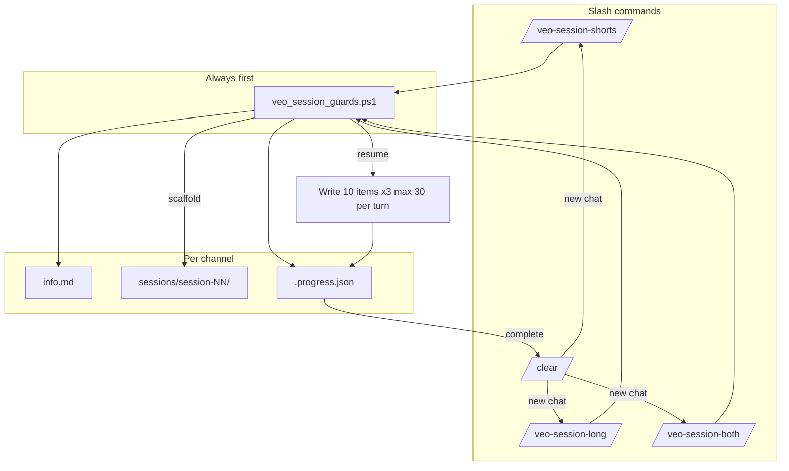

# veo-session architecture (3 commands + guards)

## The 3 commands

| Command | Mode | Delivers (per channel, per session) | Phases (in order) |
|---------|------|-------------------------------------|-------------------|
| **`/veo-session-shorts`** | `shorts` | Portrait library for Shorts only | ① prompts-shorts (900) → ② metadata-shorts (300) |
| **`/veo-session-long`** | `long` | Landscape library for long uploads only | ① prompts-long (900) → ② metadata-long (5) |
| **`/veo-session-both`** | `both` | Full channel package | ① shorts prompts → ② long prompts → ③ shorts meta → ④ long meta |
| **`/veo-session`** | router | Same as **both** (or ask user) | — |

**`/clear`** is not a builder — it tells you to open a **new chat**, then run the **same** session command for the next channel.

---

## Folder architecture

```
veo3/
  channels/
    .veo-session-queue.json      ← optional priority (cinematic first)
    .veo-session-handoff.md      ← written by /clear
    cinematic/
      info.md                    ← ALWAYS here (channel identity)
      plan.md                    ← optional channel master plan
      prompts-shorts.md          ← legacy bulk (optional)
      sessions/
        session-01/
          .progress.json         ← mode, phase, counts, next batch
          session.md
          plan.md
          prompts-shorts.md      ← if mode shorts or both
          prompts-long-videos.md ← if mode long or both
          youtube-metadata-shorts.md
          youtube-metadata-long-videos.md
          videos/                ← your veo3 downloads
          output/shorts/
          output/long-videos/
        session-02/              ← new session if 01 complete or different run
  docs/
    VEO3-PROMPT-SPEC.md
    YOUTUBE-METADATA-SPEC.md
    VEO-SESSION-ARCHITECTURE.md  ← this file
  tools/
    veo_session_guards.ps1       ← run BEFORE every write
    veo_session_progress.ps1
    veo_session_next_channel.ps1
    veo_session_list.ps1
    new_session_scaffold.ps1
```

---

## Flow diagram



---

## What happens after each command

### `/veo-session-shorts [channel]`

1. **Guards** — channel exists, mode ok, no overwrite/regression.
2. **Pick channel** — arg or `veo_session_next_channel.ps1 -Mode shorts`.
3. **Resume or scaffold** — `session-NN` with `"mode": "shorts"` in `.progress.json`.
4. **Phase 1** — append prompts **10 at a time** (max **30**/turn) until **900** portrait prompts.
5. **Phase 2** — append **10 Short metadata blocks**/turn until **300**.
6. **Done** — `status: complete`. Message: run **`/clear`**, then `/veo-session-shorts` for next channel.

**Does not create:** long prompts, long metadata.

---

### `/veo-session-long [channel]`

1. Guards → channel → resume/scaffold with `"mode": "long"`.
2. **Phase 1** — `prompts-long-videos.md` → **900** (batches of 10, max 30/turn).
3. **Phase 2** — `youtube-metadata-long-videos.md` → **5** videos.
4. Done → `/clear` → next channel with **same command**.

**Does not create:** shorts prompts, shorts metadata.

---

### `/veo-session-both [channel]`

1. Guards → channel → resume/scaffold with `"mode": "both"`.
2. **Phase 1** — shorts prompts **900**.
3. **Phase 2** — long prompts **900**.
4. **Phase 3** — shorts metadata **300**.
5. **Phase 4** — long metadata **5**.
6. Done → `/clear` → `/veo-session-both` for next channel.

---

### `/clear`

1. Writes `channels/.veo-session-handoff.md` (what finished, what’s next).
2. Tells you: **new Cursor chat** (drops bloated context).
3. **Does not** write prompts or start the next channel in the same thread.

---

## Multi-channel (10–100 channels)

```
/veo-session-shorts          → cinematic (until shorts complete)
/clear
/veo-session-shorts          → next channel with info.md
...
```

- **Queue:** `channel_order` in `.veo-session-queue.json` (optional pins).
- **Discovery:** every `channels/*/info.md` auto-included.
- **Dashboard:** `.\tools\veo_session_list.ps1 -Mode shorts`

---

## Guards (nothing goes bad)

Run **before every write**:

```powershell
.\tools\veo_session_guards.ps1 -Channel cinematic -Mode shorts
```

| Guard | Blocks if |
|-------|-----------|
| Channel missing / no `info.md` | Run `/veo-channel` first |
| Mode mismatch | e.g. `session-01` is `long` but you ran `/veo-session-shorts` |
| Session complete | Re-run without `-Force` |
| Prompt count regression | File has fewer prompts than `.progress.json` (corruption) |
| Wrong phase file | Writing long prompts while phase is `metadata-shorts` |
| Batch too large | More than 30 new items in one turn |
| Numbering gap | Next prompt must be `N+1` (no skips/duplicates) |
| Missing spec reads | Agent must read `VEO3-PROMPT-SPEC` + `YOUTUBE-METADATA-SPEC` for metadata |

**Agent rules (commands):**

- Never one Write with 900 lines.
- Never overwrite `info.md` in sessions.
- Never start next channel in same turn after complete.
- Shorts: **variety** — 3 unique places/voices per Short.
- Metadata: **unique** per Short (`YOUTUBE-METADATA-SPEC.md`).

---

## Patch limits (all commands)

| Item | Per append | Max per chat turn |
|------|------------|-------------------|
| Prompts | 10 | 30 |
| Short metadata | 10 blocks | 30 |
| Long metadata | 1–2 | 5 total |

---

## Typical timelines (one channel)

| Command | ~Chat turns (30 items/turn) |
|---------|----------------------------|
| shorts only | ~30 prompts + ~10 metadata ≈ **40** turns |
| long only | ~30 + 1 ≈ **31** turns |
| both | ~60 + ~11 ≈ **71** turns |

Plan **`/clear`** between channels, not between every turn.

---

## Spec cross-links

| Topic | Doc |
|-------|-----|
| Prompt format + variety | `docs/VEO3-PROMPT-SPEC.md` |
| Metadata uniqueness | `docs/YOUTUBE-METADATA-SPEC.md` |
| Session patches | `.cursor/commands/veo-session-shared.md` |
