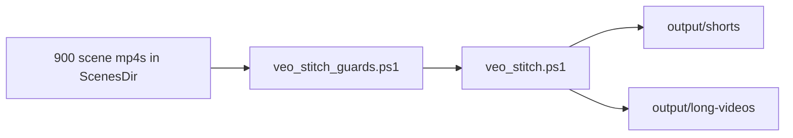

# veo-stitch architecture (FFmpeg)

Stitch **per-scene downloads** (900 × ~8s `.mp4` files) into YouTube-ready outputs.

## Commands

| Command | Output |
|---------|--------|
| **`/veo-stitch-shorts`** | **300** files: `short-001.mp4` … (3 scenes each, ~24s) |
| **`/veo-stitch-long`** | **5** files: `long-01` … `long-05` (180 scenes each, ~24 min) |
| **`/veo-stitch-both`** | Shorts folder + long folder |
| **`/veo-stitch`** | Router |

## Input you provide

Folder of **one file per scene**, named consistently:

| Pattern | Example |
|---------|---------|
| Default | `scene-001.mp4` … `scene-900.mp4` |
| OpenClaw / veo3 bulk | `scene_001.mp4` → use `-FilePrefix "scene_"` |

All clips should be **same codec, resolution, fps** (veo3 exports usually are) → FFmpeg `-c copy` (fast, lossless).

## Math

| Output | Scenes per file | Count (900 scenes) |
|--------|-----------------|---------------------|
| **Short** | **3** × 8s = **~24s** | **300** Shorts |
| **Long** | **180** × 8s = **~24 min** | **5** long videos |

Scene numbers match `Prompt 1` … `Prompt 900` in your prompts file.

## Missing or corrupt scenes (default policy)

**Default: `-SkipMissingScenes`** (recommended)

| Situation | Behavior |
|-----------|----------|
| File missing | Skip that scene; continue stitch |
| File corrupt (ffprobe fails) | Skip; log scene number |
| **Short** (3 scenes) | If **0** valid → skip that Short, warning |
| **Short** (1–2 valid) | Still export Short; **shorter** than 24s + warning |
| **Long** (180 scenes) | Concat **only valid** clips; video shorter than 24 min if many missing |
| **Long** strict | Use `-LongsSkipIncomplete` → skip entire long segment if any scene missing |

After stitch: read `output/.../stitch-report.json` and console warnings for skipped scene numbers — re-download those scenes and re-run stitch for affected Shorts/longs only.

## Output folders

```
channels/{channel}/sessions/session-01/
  output/
    shorts/           ← short-001.mp4 … short-300.mp4
    long-videos/      ← long-01-scenes-1-180.mp4 …
    stitch-report.json
```

Or `channels/{channel}/output/shorts` if not using sessions.

## Tools

```powershell
cd D:\veo3

# 1. Guards (always first)
.\tools\veo_stitch_guards.ps1 -Channel cinematic -ScenesDir "D:\YOUR\DOWNLOAD\PATH" -Mode shorts

# 2. Stitch
.\tools\veo_stitch.ps1 -Channel cinematic -ScenesDir "D:\YOUR\DOWNLOAD\PATH" -Mode shorts -SkipMissingScenes

# Long only
.\tools\veo_stitch.ps1 -Channel cinematic -ScenesDir "D:\path" -Mode long -Session session-01

# Both
.\tools\veo_stitch.ps1 -Channel cinematic -ScenesDir "D:\path" -Mode both

# Dry run (concat lists only, no ffmpeg output)
.\tools\veo_stitch.ps1 -Channel cinematic -ScenesDir "D:\path" -Mode shorts -DryRun
```

Low-level script (same engine): `tools/stitch_veo_scenes.ps1`

## Flow



## After stitch

Upload using `youtube-metadata-shorts.md` / `youtube-metadata-long-videos.md` (titles aligned to `short-NNN.mp4`).

## Relation to old `/veo-merge`

`/veo-merge` = trim from **one big veo3 pack download** (30 scenes in one mp4).  
`/veo-stitch-*` = concat **separate scene files** (your 900 individual clips).
